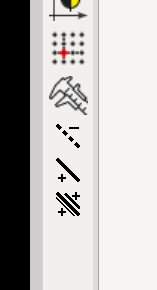
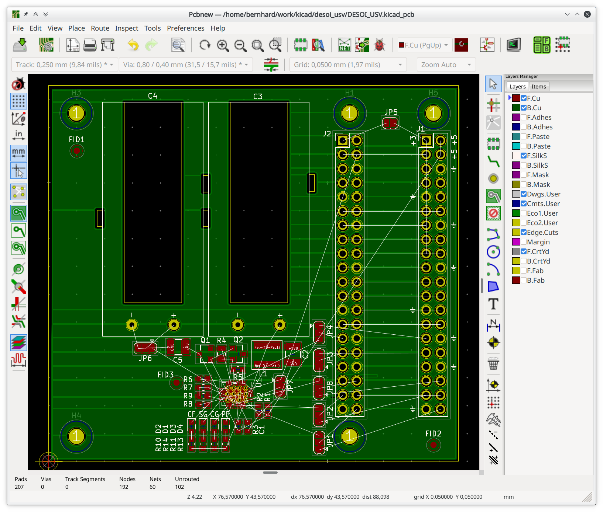
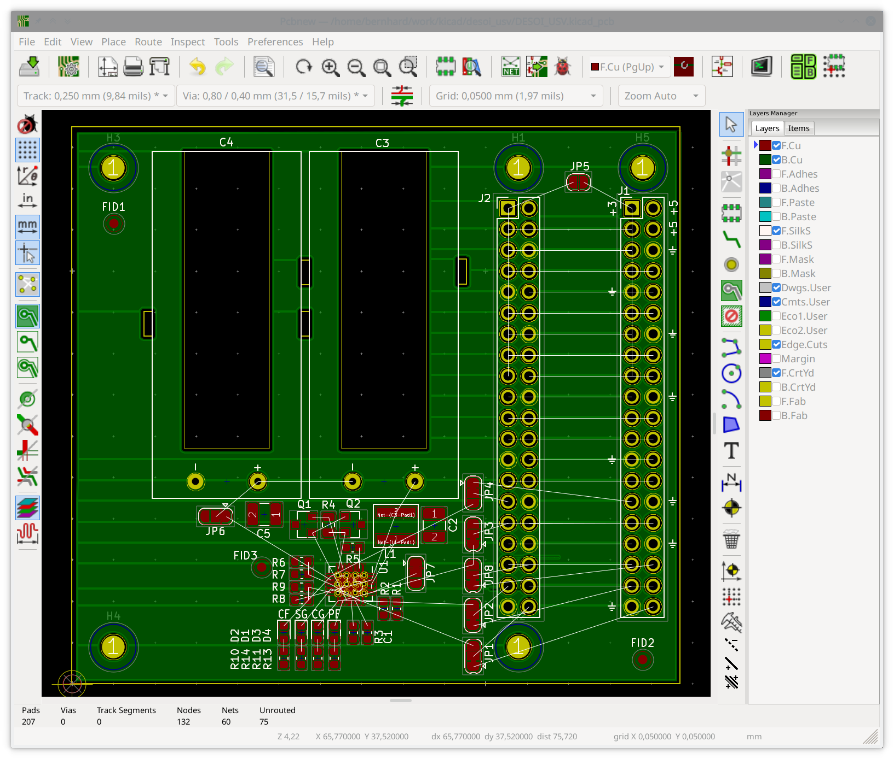

# ShowHideNets

When I was layouting som litte board in KiCAD I found it very annoying that I could not hide some of the ratnests lines (for instance having a 4 Layer print but still going GND and VCC ratnest all over the place). This Little Plugin can be used to hide and show ratnest lines. Actually, the lines are removed and added to the netlist as required.

Usage: copy the folder ShowHideNets to your KiCAD plugin folder (usually ~/.kicad/scripting/plugins) and activate it in pcbnew under Tools/External Plugins/ShowHideNets and it will add three new buttons to KiCADs right vertical Toolbar.

The first button is used to hide Nets. When you click on it you are Presented with a list of all Nets (which are not already hidden) and can choose one or multiple nets to hide.

The second button is used to make individual nets visible again.

The third Button is used to make all Nets visible again.

The Plugin is based on WireIt by XESS Corp.

Have fun with it

Before:

After:

## Help Appreciated:
I would like to show only Nets which have visible ratnest lines but could not manage to do it using the python plugin system. If you know a way of doing it, help would be appreciated.
